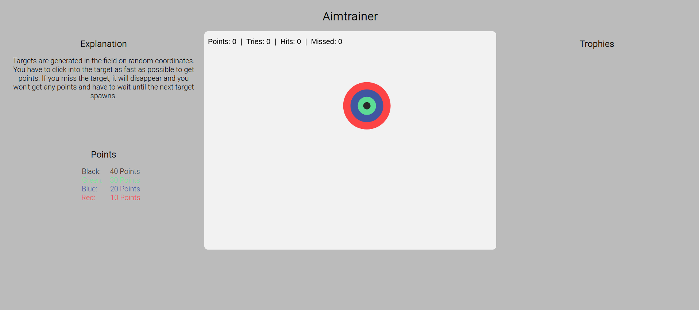

# UE12_JS_Canvas_Zielscheibe

The goal of the game is to hit the target with the cursor as many times as possible to score points. Through the points you get trophies later.
If you miss, the target disappears and you have to wait until a new target spawns.

BLACK Circle:&ensp;40 Points 
GREEN Circle:&nbsp;30 Points 
BLUE Circle:&emsp;&nbsp;20 Points 
RED Circle:&emsp;&ensp;&nbsp;10 Points 